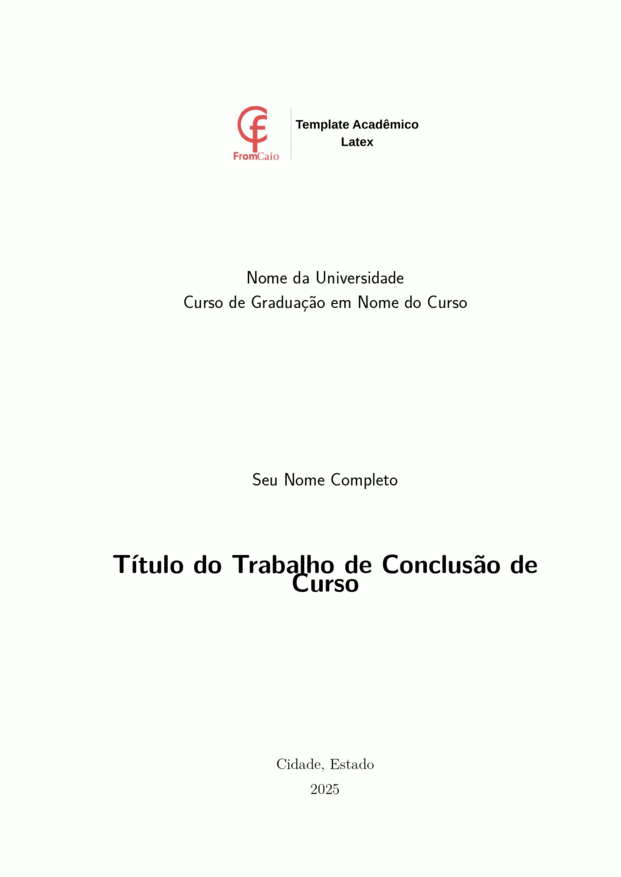

# Template LaTeX para Trabalho de Conclusão de Curso (TCC)



Este projeto oferece um template LaTeX moderno e flexível, projetado para a criação de trabalhos acadêmicos profissionais, como TCCs, monografias e relatórios de pesquisa, seguindo as normas da ABNT. A estrutura é baseada na classe abntex2 e foi customizada na classe undergrad_thesis.cls para simplificar a configuração e o uso.

## Principais Características

- Estrutura Modular: O trabalho é organizado em arquivos separados para elementos pré-textuais, capítulos e conteúdo pós-textual, facilitando o gerenciamento de documentos longos.
- Classe Personalizada (undergrad_thesis.cls): Centraliza as customizações de layout, como a capa e a folha de rosto, separando a formatação do conteúdo do trabalho.
- Conformidade com a ABNT: Baseado na suíte abntex2, o template segue as diretrizes da Associação Brasileira de Normas Técnicas para formatação de trabalhos acadêmicos.
- Capa e Folha de Rosto Automáticas: Comandos como \imprimircapalogo e \imprimirfolhaderosto geram as páginas iniciais do trabalho com base nas informações que você preenche.
- Listagens de Código Avançadas: Pré-configurado com o pacote minted para blocos de código com realce de sintaxe profissional (requer a biblioteca Pygments do Python).
- Makefile para Limpeza: Inclui um comando make clean que remove todos os arquivos auxiliares e temporários gerados pelo LaTeX, mantendo seu projeto organizado.
- Gerenciamento de Bibliografia: Utiliza BibTeX (references.bib) e o pacote abntex2cite para gerenciar e formatar automaticamente as citações e referências.

## Estrutura de Arquivos

O projeto é organizado em diretórios lógicos para manter o conteúdo bem estruturado:

```bash
.
├── Makefile
├── README.md
├── undergrad_thesis.cls
├── main.tex
├── main.pdf
├── references.bib
├── pretextual_elements.tex
├── acronyms.tex
├── imgs/
│   └── university-logo.jpg
├── chapters/
│   ├── 01_introduction.tex
│   ├── 02_related_work.tex
│   └── ...
└── posttextual/
    └── appendix_a.tex
```

- main.tex: O arquivo raiz que une todo o documento. As informações do trabalho (título, autor, orientador, etc.) são configuradas aqui.
- undergrad_thesis.cls: O arquivo de classe personalizado que define o layout da capa e da folha de rosto.
- chapters/: Contém os arquivos .tex para cada capítulo do trabalho.
- pretextual_elements.tex: Inclui resumo, abstract, dedicatória, agradecimentos, etc.
- acronyms.tex: Arquivo para a lista de siglas e abreviaturas.
- posttextual/: Armazena apêndices e anexos.
- references.bib: O arquivo BibTeX para gerenciar todas as referências bibliográficas.
- Makefile: Um script utilitário para ajudar a limpar o diretório do projeto.
- imgs/: Diretório para armazenar imagens, como o logo da sua universidade.

## Pré-requisitos

1. Distribuição LaTeX: Uma instalação completa do LaTeX, como TeX Live, MiKTeX ou MacTeX.

2. Pacotes LaTeX: Certifique-se de que todos os pacotes utilizados no template (como abntex2, minted, graphicx, etc.) estejam instalados. A maioria das distribuições LaTeX modernas, como o TeX Live, pode instalar pacotes ausentes automaticamente na primeira compilação.

3. Python e Pygments: O pacote minted requer Python e a biblioteca Pygments para o realce de sintaxe. Você pode instalar o Pygments usando pip:
    ```sh
    pip install Pygments
    ```

## Como Usar

1. Configure seu Trabalho: Abra o arquivo main.tex e preencha as informações do seu TCC na seção Informações do Documento:
    ```latex
    \titulo{Título do Trabalho de Conclusão de Curso}
    \autor{Seu Nome Completo}
    \local{Cidade, Estado}
    \data{\the\year}
    \orientador{Prof. Dr. Nome do Orientador}
    \instituicao{Nome da Universidade \par Curso de Graduação}
    \logo{imgs/university-logo.jpg}
    ```
2. Adicione seu Conteúdo:
    - Escreva seus capítulos nos arquivos correspondentes dentro do diretório chapters/.
    - Edite pretextual_elements.tex para escrever seu resumo, dedicatória e agradecimentos.
    - Adicione suas entradas bibliográficas no arquivo references.bib.

3. Compile o Documento: Como o template utiliza o pacote minted, é necessário compilar com a flag -shell-escape ativada. A ferramenta recomendada é o latexmk, que automatiza as múltiplas compilações necessárias para o sumário, citações e referências.
    ```sh
    latexmk -pdf -shell-escape main.tex
    ```
4. Limpe os Arquivos Auxiliares: Após a compilação, você pode remover todos os arquivos temporários executando:
    ```sh
    make clean
    ```

## Personalização
### stilo de Citação

O template utiliza o estilo numérico da ABNT (abnt-num) por padrão. Para alterar para o estilo autor-data (abnt-alf), modifique a linha de importação do pacote abntex2cite em main.tex:

```latex
% De:
\usepackage[num]{abntex2cite}
% Para:
\usepackage[alf]{abntex2cite}
```

### Cores dos Links

A cor dos hyperlinks é definida em main.tex. Você pode modificar o comando \definecolor para usar a cor que preferir.

```latex
\definecolor{hyperlinkblue}{RGB}{41, 5, 195}
```

### Seções do Documento

Você pode facilmente adicionar ou remover capítulos, apêndices ou anexos adicionando ou comentando os comandos \include{} correspondentes em main.tex.